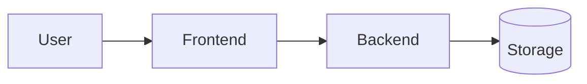

# Architecture

A map of the system for someone who just cloned it. Keep this current — a stale
architecture doc is worse than none, because it is believed.

## The shape

Describe the top-level pieces and how a request flows through them. A diagram
earns its place here; prose alone rarely does.

## The pieces

| Piece | Responsibility | Lives in |
| --- | --- | --- |
| Frontend | What the user sees and does | `src/` |
| Backend | Business logic and the API contract | _describe_ |
| Storage | Persistence | _describe_ |

## The boundaries that matter

State the rules that keep the pieces honest — the ones that, if broken, make the
system hard to change. For example: "no HTTP type crosses into the service layer,"
or "the frontend talks to exactly one origin."

## Decisions

The reasoning behind the choices above lives in [`adr/`](adr/README.md). This
document says *what* the system is; an ADR says *why* it is that and not something
else.
